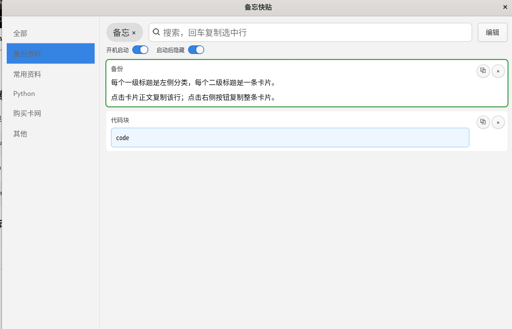

# Quick Memo / 备忘快贴

Quick Memo 是一个轻量的 Linux 桌面备忘片段工具，用 Markdown 管理内容，适合保存命令、代码片段、常用文本和小段备忘。

它的交互目标是替代 uTools「备忘快贴」里最常用的片段检索和复制能力，同时更适合 GNOME Wayland 环境。

## 功能

- Markdown 文件存储，方便备份、Git 管理和手动编辑。
- 左侧按一级标题分类。
- 每个二级标题是一张卡片。
- 搜索时过滤卡片，并高亮命中的标题或正文。
- 单击标题：复制标题。
- 单击正文行：只复制这一行。
- 右侧复制按钮：复制整张卡片正文。
- 右侧删除按钮：二次确认后删除整张卡片。
- `Esc` 隐藏窗口。
- 支持程序内开关：开机启动、开机启动后隐藏。
- 支持 GNOME 自定义快捷键呼出/隐藏。

## 截图

暂无。可以运行程序后自行截图放到仓库里。

## 运行环境

目标环境：Debian / Ubuntu / GNOME 桌面。

已在以下环境开发验证：

- Debian 13 trixie
- GNOME 48
- Wayland
- Python 3
- GTK 4

### 运行依赖

Debian/Ubuntu 包：

```bash
sudo apt install python3 python3-gi gir1.2-gtk-4.0 gir1.2-pango-1.0 wl-clipboard wmctrl
```

推荐安装文本编辑器，用于点击「编辑」按钮打开备忘文件：

```bash
sudo apt install gnome-text-editor
```

如果没有 `gnome-text-editor`，程序会尝试使用 `gedit` 或 `xdg-open`。

### 构建 deb 依赖

如果要从源码构建 `.deb`：

```bash
sudo apt install build-essential dpkg-dev debhelper desktop-file-utils fakeroot
```

如果只是使用仓库自带的 `scripts/build-deb.sh` 打包脚本，至少需要：

```bash
sudo apt install dpkg-dev fakeroot desktop-file-utils
```

## 安装

### 方式一：安装 deb 包

```bash
sudo apt install ./quickmemo_0.1.0-1_all.deb
```

安装后可以从应用菜单启动「备忘快贴」，也可以在终端运行：

```bash
quickmemo
```

### 方式二：源码直接运行

```bash
chmod +x src/quickmemo
./src/quickmemo
```

## 使用方法

### 数据文件位置

用户数据默认保存在：

```text
~/.local/share/quickmemo/memos.md
```

配置文件默认保存在：

```text
~/.config/quickmemo/config.json
```

开机启动文件默认保存在：

```text
~/.config/autostart/quickmemo.desktop
```

### Markdown 格式

一级标题是左侧分类：

```md
# Git
```

二级标题是一张卡片标题：

```md
## 查看远程分支
```

二级标题下面的内容是卡片正文：

```md
# Git

## 查看远程分支
git branch -r

## 清理远程已删除分支
git remote prune origin
```

显示效果：

- 左侧分类：`Git`
- 卡片标题：`查看远程分支`、`清理远程已删除分支`
- 点击 `git branch -r` 只复制这一行。
- 点击卡片右侧复制按钮复制整张卡片正文。

### 搜索

在顶部搜索框输入关键词：

- 会过滤出命中的卡片。
- 标题和正文里的命中文字会高亮。
- 回车会复制第一条搜索结果里的第一行正文。

### 复制

- 单击标题：复制标题。
- 单击正文任意一行：复制该行。
- 单击右侧 `⧉`：复制整张卡片正文。

Wayland 下程序会优先使用 GTK 剪贴板，同时如果安装了 `wl-clipboard`，会调用 `wl-copy` 提高复制稳定性。

### 删除

单击右侧 `×` 删除整张卡片。删除前会二次确认。

删除会直接修改 `~/.local/share/quickmemo/memos.md`，建议把这个文件纳入自己的备份或 Git 仓库。

### 编辑

点击右上角「编辑」按钮，会打开 `memos.md`。

编辑保存后，重新打开程序即可读取最新内容。

### 开机启动

程序界面里有两个开关：

- 开机启动：写入或删除 `~/.config/autostart/quickmemo.desktop`。
- 启动后隐藏：仅影响开机自启。手动点击桌面图标或运行 `quickmemo` 时仍会显示窗口。

### 快捷键

程序内快捷键：

- `Esc`：隐藏窗口。
- `Alt + Space`：窗口有焦点时切换显示/隐藏。

GNOME Wayland 不允许普通 GTK 程序注册真正的全局快捷键。如果要在任意应用里按快捷键呼出，需要在 GNOME 里添加系统快捷键：

```text
设置 → 键盘 → 查看和自定义快捷键 → 自定义快捷键
```

添加：

```text
名称：备忘快贴
命令：quickmemo
快捷键：Alt + Space
```

如果 `Alt + Space` 被系统占用，可以先禁用 GNOME 原有窗口菜单快捷键，或者改用 `Ctrl + Alt + V`。

## 构建 deb

推荐使用仓库自带脚本，它不依赖 debhelper：

```bash
./scripts/build-deb.sh
```

构建完成后，deb 文件会生成在：

```text
dist/quickmemo_0.1.0-1_all.deb
```

也可以使用 Debian 标准构建流程：

```bash
dpkg-buildpackage -us -uc -b
```

标准构建需要安装 `debhelper`。构建完成后，deb 文件会生成在父目录，例如：

```text
../quickmemo_0.1.0-1_all.deb
```


## 插图



## GitHub 发布建议

首次推送：

```bash
git init
git add .
git commit -m "Initial quickmemo release"
git branch -M main
git remote add origin <your-repo-url>
git push -u origin main
```

发布 deb：

1. 在 GitHub 创建 Release。
2. 上传 `quickmemo_0.1.0-1_all.deb`。
3. 在 Release Notes 里写明依赖和安装命令。

## 卸载

如果通过 deb 安装：

```bash
sudo apt remove quickmemo
```

用户数据不会自动删除。如需删除数据：

```bash
rm -rf ~/.local/share/quickmemo ~/.config/quickmemo ~/.config/autostart/quickmemo.desktop
```

## 许可证

MIT License，见 [LICENSE](LICENSE)。
